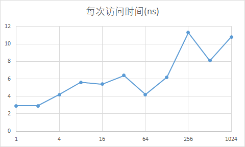

* **问题 1 答案**  
gettimeofday的精度只有微秒。本身无法测量单次访问内存页的计时。  
我们可以选择多次一起测量，然后取平均值就能得到单次的访问时间了。
```
[testjz@localhost OS_test]$ getconf PAGE_SIZE
4096
```
我的机器上页大小是4096.

后续碰到问题是tv_usec循环计数太快，如果尝试次数太多，容易产生tv_usec结束时间小于开始时间的现象，但是改用tv_sec,加大循环次数就很容易时间过长，或者由于精度不够无法计算出正常的结果。

* **问题 2 答案**  
[答案代码 19.2.c](19.2.c)
```C
#include<stdio.h>
#include<sys/time.h>
#include<stdlib.h>

#define PAGESIZE 4096

int main(int argc, char *argv[])
{
	if(argc != 3) {
		fprintf(stderr, "error parameters!");
		exit(0);
	}
	struct timeval start, end;
	int pageNum = atoi(argv[1]);
	int i,j, num = atoi(argv[2]);
	char arr[PAGESIZE * pageNum];
	
	gettimeofday(&start, NULL);
	for(j=0; j<num; ++j) {
		for(i=0; i<pageNum; ++i) {
			arr[i*4096]=1;
		}
	}
	gettimeofday(&end, NULL);
	printf("%lf %d %d\n", (((double)end.tv_usec - start.tv_usec)/pageNum)/num, end.tv_usec, start.tv_usec);
	return 0;
}
```

* **问题 3 答案**  
[答案代码 19.3.py](19.3.py)
```python
#!/usr/bin/env python
import os
i = 1
while i < 2000 :
	print '\npage num ' + str(i)
	val = os.system('./19.2 ' + str(i) + ' ' + str(10000))
	i = i * 2
```
执行结果：
```
[testjz@localhost OS_test]$ ./19.3.py

page num 1
0.002900 20020 19991

page num 2
0.002900 22596 22538

page num 4
0.004225 24881 24712

page num 8
0.005600 27568 27120

page num 16
0.005437 47595 46725

page num 32
0.006356 52188 50154

page num 64
0.004256 57382 54658

page num 128
0.006168 67493 59598

page num 256
0.011337 99703 70681

page num 512
0.008093 143608 102172

page num 1024
0.010835 257282 146336
```

* **问题 4 答案**  
  
使用excel画图

* **问题 5 答案**  
禁止编辑器优化，编译时候增加命令-O0 

* **问题 6 答案**  
使用虚拟机限制只有一个CPU即可。  
如果代码移动到另一个CPU，那么显然TLB结构都是未命中，会增加访问时间。  

* **问题 7 答案**  
在开始计时前把整个数组初始化即可。  
更新的代码如下：
[答案代码 19.7.c](19.7.c)
```C
#include<stdio.h>
#include<sys/time.h>
#include<stdlib.h>

#define PAGESIZE 4096

int main(int argc, char *argv[])
{
	if(argc != 3) {
		fprintf(stderr, "error parameters!");
		exit(0);
	}
	struct timeval start, end;
	int pageNum = atoi(argv[1]);
	int i,j, num = atoi(argv[2]);
	char arr[PAGESIZE * pageNum];
	for(i=0; i<PAGESIZE*pageNum; ++i) {
		arr[i] = 0;
	}
	
	gettimeofday(&start, NULL);
	for(j=0; j<num; ++j) {
		for(i=0; i<pageNum; ++i) {
			arr[i*4096]=1;
		}
	}
	gettimeofday(&end, NULL);
	printf("%lf %d %d\n", (((double)end.tv_usec - start.tv_usec)/pageNum)/num, end.tv_usec, start.tv_usec);
	return 0;
}
```
