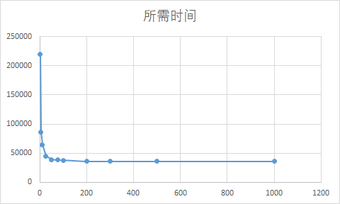

由于我用的Linux没安装tk，这里使用windows系统来模拟。仅写出命令和最后的统计结果。  
* **问题 1 答案**  
```
ostep-homework-master\file-disks> python disk.py -a 0 -G

REQUESTS ['0']

Block:   0  Seek:  0  Rotate:165  Transfer: 30  Total: 195

TOTALS      Seek:  0  Rotate:165  Transfer: 30  Total: 195

ostep-homework-master\file-disks> python disk.py -a 6 -G

REQUESTS ['6']

Block:   6  Seek:  0  Rotate:345  Transfer: 30  Total: 375

TOTALS      Seek:  0  Rotate:345  Transfer: 30  Total: 375

ostep-homework-master\file-disks> python disk.py -a 30 -G

REQUESTS ['30']

Block:  30  Seek: 80  Rotate:265  Transfer: 30  Total: 375

TOTALS      Seek: 80  Rotate:265  Transfer: 30  Total: 375

ostep-homework-master\file-disks> python disk.py -a 7,30,8 -G

REQUESTS ['7', '30', '8']

Block:   7  Seek:  0  Rotate: 15  Transfer: 30  Total:  45
Block:  30  Seek: 80  Rotate:220  Transfer: 30  Total: 330
Block:   8  Seek: 80  Rotate:310  Transfer: 30  Total: 420

TOTALS      Seek:160  Rotate:545  Transfer: 90  Total: 795

ostep-homework-master\file-disks> python disk.py -a 10,11,12,13 -G

REQUESTS ['10', '11', '12', '13']

Block:  10  Seek:  0  Rotate:105  Transfer: 30  Total: 135
Block:  11  Seek:  0  Rotate:  0  Transfer: 30  Total:  30
Block:  12  Seek: 40  Rotate:320  Transfer: 30  Total: 390
Block:  13  Seek:  0  Rotate:  0  Transfer: 30  Total:  30

TOTALS      Seek: 40  Rotate:425  Transfer:120  Total: 585
```

* **问题 2 答案**  
组合太多，这里就不给结果了。  
对于没有寻道的请求无变化，有寻道的请求有时间变化。  

* **问题 3 答案**  
组合太多，这里就不给结果了。  
所有的请求的旋转时间都变慢了。  

* **问题 4 答案**  
FIFO就是顺序执行。  
```
ostep-homework-master\file-disks> python disk.py -a 7,30,8 -p SSTF -G

REQUESTS ['7', '30', '8']

Block:   7  Seek:  0  Rotate: 15  Transfer: 30  Total:  45
Block:   8  Seek:  0  Rotate:  0  Transfer: 30  Total:  30
Block:  30  Seek: 80  Rotate:190  Transfer: 30  Total: 300

TOTALS      Seek: 80  Rotate:205  Transfer: 90  Total: 375
```


* **问题 5 答案**  
```
ostep-homework-master\file-disks> python disk.py -a 7,30,8 -p SATF -G

REQUESTS ['7', '30', '8']

Block:   7  Seek:  0  Rotate: 15  Transfer: 30  Total:  45
Block:   8  Seek:  0  Rotate:  0  Transfer: 30  Total:  30
Block:  30  Seek: 80  Rotate:190  Transfer: 30  Total: 300

TOTALS      Seek: 80  Rotate:205  Transfer: 90  Total: 375
```
对7,30,8的请求与SSTF方法结果相同。  
SATF明显优于SSTF的请求：7,6,24  
```
ostep-homework-master\file-disks> python disk.py -a 7,6,24 -p SATF -G

REQUESTS ['7', '6', '24']

Block:   7  Seek:  0  Rotate: 15  Transfer: 30  Total:  45
Block:  24  Seek: 80  Rotate: 40  Transfer: 30  Total: 150
Block:   6  Seek: 80  Rotate: 70  Transfer: 30  Total: 180

TOTALS      Seek:160  Rotate:125  Transfer: 90  Total: 375

ostep-homework-master\file-disks> python disk.py -a 7,6,24 -p SSTF -G

REQUESTS ['7', '6', '24']

Block:   7  Seek:  0  Rotate: 15  Transfer: 30  Total:  45
Block:   6  Seek:  0  Rotate:300  Transfer: 30  Total: 330
Block:  24  Seek: 80  Rotate: 70  Transfer: 30  Total: 180

TOTALS      Seek: 80  Rotate:385  Transfer: 90  Total: 555
```
出现差异的原因是同一磁道的旋转时间太长，大于先去其它磁道读取再回来的时间。  

* **问题 6 答案**  
因为磁盘寻道的同时也在旋转，因此到了下一个磁道时已经超过应该读取的位置了，只能额外转一圈。  
```
ostep-homework-master\file-disks> python disk.py -a 10,11,12,13 -o 2 -G

REQUESTS ['10', '11', '12', '13']

Block:  10  Seek:  0  Rotate:105  Transfer: 30  Total: 135
Block:  11  Seek:  0  Rotate:  0  Transfer: 30  Total:  30
Block:  12  Seek: 40  Rotate: 20  Transfer: 30  Total:  90
Block:  13  Seek:  0  Rotate:  0  Transfer: 30  Total:  30

TOTALS      Seek: 40  Rotate:125  Transfer:120  Total: 285

ostep-homework-master\file-disks> python disk.py -a 10,11,12,13 -S 2 -o 1 -G

REQUESTS ['10', '11', '12', '13']

Block:  10  Seek:  0  Rotate:105  Transfer: 30  Total: 135
Block:  11  Seek:  0  Rotate:  0  Transfer: 30  Total:  30
Block:  12  Seek: 20  Rotate: 10  Transfer: 30  Total:  60
Block:  13  Seek:  0  Rotate:  0  Transfer: 30  Total:  30

TOTALS      Seek: 20  Rotate:115  Transfer:120  Total: 255

ostep-homework-master\file-disks> python disk.py -a 10,11,12,13 -S 4 -o 1 -G

REQUESTS ['10', '11', '12', '13']

Block:  10  Seek:  0  Rotate:105  Transfer: 30  Total: 135
Block:  11  Seek:  0  Rotate:  0  Transfer: 30  Total:  30
Block:  12  Seek: 10  Rotate: 20  Transfer: 30  Total:  60
Block:  13  Seek:  0  Rotate:  0  Transfer: 30  Total:  30

TOTALS      Seek: 10  Rotate:125  Transfer:120  Total: 255
```
实际的偏斜距离要大于单个寻道时间磁盘旋转的距离。  

* **问题 7 答案**  
```
ostep-homework-master\file-disks> python disk.py -z 10,20,30 -a -1 -A 5,-1,0 -s 1 -G

REQUESTS [7, 45, 41, 13, 26]

Block:   7  Seek:  0  Rotate:245  Transfer: 10  Total: 255
Block:  45  Seek: 40  Rotate: 55  Transfer: 20  Total: 115
Block:  41  Seek:  0  Rotate:260  Transfer: 20  Total: 280
Block:  13  Seek: 40  Rotate:335  Transfer: 10  Total: 385
Block:  26  Seek:  0  Rotate:120  Transfer: 10  Total: 130

TOTALS      Seek: 80  Rotate:1015  Transfer: 70  Total:1165

ostep-homework-master\file-disks> python disk.py -z 10,20,30 -a -1 -A 5,-1,0 -s 2 -G

REQUESTS [51, 51, 3, 4, 45]

Block:  51  Seek: 40  Rotate: 70  Transfer: 20  Total: 130
Block:  51  Seek:  0  Rotate:340  Transfer: 20  Total: 360
Block:   3  Seek: 40  Rotate: 35  Transfer: 10  Total:  85
Block:   4  Seek:  0  Rotate:  0  Transfer: 10  Total:  10
Block:  45  Seek: 40  Rotate: 85  Transfer: 20  Total: 145

TOTALS      Seek:120  Rotate:530  Transfer: 80  Total: 730
```
单位时间扇区数:
内圈1/30，中圈1/20，外圈1/10.

* **问题 8 答案**  
```
ostep-homework-master\file-disks> python disk.py -A 1000,-1,0 -p SATF -w 1 -c
TOTALS      Seek:20960  Rotate:169165  Transfer:30000  Total:220125
ostep-homework-master\file-disks> python disk.py -A 1000,-1,0 -p SATF -w 5 -c
TOTALS      Seek:11280  Rotate:44955  Transfer:30000  Total:86235
ostep-homework-master\file-disks> python disk.py -A 1000,-1,0 -p SATF -w 10 -c
TOTALS      Seek:8080  Rotate:26555  Transfer:30000  Total:64635
ostep-homework-master\file-disks> python disk.py -A 1000,-1,0 -p SATF -w 25 -c
TOTALS      Seek:3440  Rotate:11395  Transfer:30000  Total:44835
ostep-homework-master\file-disks> python disk.py -A 1000,-1,0 -p SATF -w 50 -c
TOTALS      Seek:1680  Rotate:7035  Transfer:30000  Total:38715
ostep-homework-master\file-disks> python disk.py -A 1000,-1,0 -p SATF -w 75 -c 
TOTALS      Seek:1760  Rotate:6595  Transfer:30000  Total:38355
ostep-homework-master\file-disks> python disk.py -A 1000,-1,0 -p SATF -w 100 -c
TOTALS      Seek:1440  Rotate:5835  Transfer:30000  Total:37275
ostep-homework-master\file-disks> python disk.py -A 1000,-1,0 -p SATF -w 200 -c
TOTALS      Seek:960  Rotate:4515  Transfer:30000  Total:35475
ostep-homework-master\file-disks> python disk.py -A 1000,-1,0 -p SATF -w 300 -c
TOTALS      Seek:1120  Rotate:4355  Transfer:30000  Total:35475
ostep-homework-master\file-disks> python disk.py -A 1000,-1,0 -p SATF -w 500 -c
TOTALS      Seek:1280  Rotate:4195  Transfer:30000  Total:35475
ostep-homework-master\file-disks> python disk.py -A 1000,-1,0 -p SATF -w 1000 -c
TOTALS      Seek:1520  Rotate:3955  Transfer:30000  Total:35475
```
  

* **问题 9 答案**  
导致第一个请求的扇区饥饿的序列：
```
ostep-homework-master\file-disks> python disk.py -a 24,7,8,9,10,11,0,1,2,3,4,5,6 -p SATF -G

REQUESTS ['24', '7', '8', '9', '10', '11', '0', '1', '2', '3', '4', '5', '6']

Block:   7  Seek:  0  Rotate: 15  Transfer: 30  Total:  45
Block:   8  Seek:  0  Rotate:  0  Transfer: 30  Total:  30
Block:   9  Seek:  0  Rotate:  0  Transfer: 30  Total:  30
Block:  10  Seek:  0  Rotate:  0  Transfer: 30  Total:  30
Block:  11  Seek:  0  Rotate:  0  Transfer: 30  Total:  30
Block:   0  Seek:  0  Rotate:  0  Transfer: 30  Total:  30
Block:   1  Seek:  0  Rotate:  0  Transfer: 30  Total:  30
Block:   2  Seek:  0  Rotate:  0  Transfer: 30  Total:  30
Block:   3  Seek:  0  Rotate:  0  Transfer: 30  Total:  30
Block:   4  Seek:  0  Rotate:  0  Transfer: 30  Total:  30
Block:   5  Seek:  0  Rotate:  0  Transfer: 30  Total:  30
Block:   6  Seek:  0  Rotate:  0  Transfer: 30  Total:  30
Block:  24  Seek: 80  Rotate: 70  Transfer: 30  Total: 180

TOTALS      Seek: 80  Rotate: 85  Transfer:390  Total: 555
```
使用有界的SATF方法：
```
ostep-homework-master\file-disks> python disk.py -a 24,7,8,9,10,11,0,1,2,3,4,5,6 -p BSATF -w 4 -G

REQUESTS ['24', '7', '8', '9', '10', '11', '0', '1', '2', '3', '4', '5', '6']

Block:   7  Seek:  0  Rotate: 15  Transfer: 30  Total:  45
Block:   8  Seek:  0  Rotate:  0  Transfer: 30  Total:  30
Block:   9  Seek:  0  Rotate:  0  Transfer: 30  Total:  30
Block:  24  Seek: 80  Rotate:340  Transfer: 30  Total: 450
Block:  10  Seek: 80  Rotate:190  Transfer: 30  Total: 300
Block:  11  Seek:  0  Rotate:  0  Transfer: 30  Total:  30
Block:   0  Seek:  0  Rotate:  0  Transfer: 30  Total:  30
Block:   1  Seek:  0  Rotate:  0  Transfer: 30  Total:  30
Block:   2  Seek:  0  Rotate:  0  Transfer: 30  Total:  30
Block:   3  Seek:  0  Rotate:  0  Transfer: 30  Total:  30
Block:   4  Seek:  0  Rotate:  0  Transfer: 30  Total:  30
Block:   5  Seek:  0  Rotate:  0  Transfer: 30  Total:  30
Block:   6  Seek:  0  Rotate:  0  Transfer: 30  Total:  30

TOTALS      Seek:160  Rotate:545  Transfer:390  Total:1095
```
可以解决饥饿问题，但是IO时间增加了。  
应该设置合适的窗口大小，在性能和避免饥饿之间平衡。  

* **问题 10 答案**  
全局最优的调度比贪婪方法好的例子 10,11,0,21,1,2,3,4,5,6  
全局最优由FIFO方法，手动指定全局调度结果。
```
ostep-homework-master\file-disks> python disk.py -a 10,11,0,21,1,2,3,4,5,6 -p SATF -G

REQUESTS ['10', '11', '0', '21', '1', '2', '3', '4', '5', '6']

Block:  21  Seek: 40  Rotate: 35  Transfer: 30  Total: 105
Block:   0  Seek: 40  Rotate: 20  Transfer: 30  Total:  90
Block:   1  Seek:  0  Rotate:  0  Transfer: 30  Total:  30
Block:   2  Seek:  0  Rotate:  0  Transfer: 30  Total:  30
Block:   3  Seek:  0  Rotate:  0  Transfer: 30  Total:  30
Block:   4  Seek:  0  Rotate:  0  Transfer: 30  Total:  30
Block:   5  Seek:  0  Rotate:  0  Transfer: 30  Total:  30
Block:   6  Seek:  0  Rotate:  0  Transfer: 30  Total:  30
Block:  10  Seek:  0  Rotate: 90  Transfer: 30  Total: 120
Block:  11  Seek:  0  Rotate:  0  Transfer: 30  Total:  30

TOTALS      Seek: 80  Rotate:145  Transfer:300  Total: 525

ostep-homework-master\file-disks> python disk.py -a 10,11,0,1,2,3,4,5,6,21 -G

REQUESTS ['10', '11', '0', '1', '2', '3', '4', '5', '6', '21']

Block:  10  Seek:  0  Rotate:105  Transfer: 30  Total: 135
Block:  11  Seek:  0  Rotate:  0  Transfer: 30  Total:  30
Block:   0  Seek:  0  Rotate:  0  Transfer: 30  Total:  30
Block:   1  Seek:  0  Rotate:  0  Transfer: 30  Total:  30
Block:   2  Seek:  0  Rotate:  0  Transfer: 30  Total:  30
Block:   3  Seek:  0  Rotate:  0  Transfer: 30  Total:  30
Block:   4  Seek:  0  Rotate:  0  Transfer: 30  Total:  30
Block:   5  Seek:  0  Rotate:  0  Transfer: 30  Total:  30
Block:   6  Seek:  0  Rotate:  0  Transfer: 30  Total:  30
Block:  21  Seek: 40  Rotate: 20  Transfer: 30  Total:  90

TOTALS      Seek: 40  Rotate:125  Transfer:300  Total: 465
```
