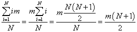

* **问题 1 答案**  
```
[testjz@localhost cpu-sched]$ ./scheduler.py -p FIFO -l 200,200,200 -c
ARG policy FIFO
ARG jlist 200,200,200

Here is the job list, with the run time of each job: 
  Job 0 ( length = 200.0 )
  Job 1 ( length = 200.0 )
  Job 2 ( length = 200.0 )


** Solutions **

Execution trace:
  [ time   0 ] Run job 0 for 200.00 secs ( DONE at 200.00 )
  [ time 200 ] Run job 1 for 200.00 secs ( DONE at 400.00 )
  [ time 400 ] Run job 2 for 200.00 secs ( DONE at 600.00 )

Final statistics:
  Job   0 -- Response: 0.00  Turnaround 200.00  Wait 0.00
  Job   1 -- Response: 200.00  Turnaround 400.00  Wait 200.00
  Job   2 -- Response: 400.00  Turnaround 600.00  Wait 400.00

  Average -- Response: 200.00  Turnaround 400.00  Wait 200.00

[testjz@localhost cpu-sched]$ ./scheduler.py -p SJF -l 200,200,200 -c
ARG policy SJF
ARG jlist 200,200,200

Here is the job list, with the run time of each job: 
  Job 0 ( length = 200.0 )
  Job 1 ( length = 200.0 )
  Job 2 ( length = 200.0 )


** Solutions **

Execution trace:
  [ time   0 ] Run job 0 for 200.00 secs ( DONE at 200.00 )
  [ time 200 ] Run job 1 for 200.00 secs ( DONE at 400.00 )
  [ time 400 ] Run job 2 for 200.00 secs ( DONE at 600.00 )

Final statistics:
  Job   0 -- Response: 0.00  Turnaround 200.00  Wait 0.00
  Job   1 -- Response: 200.00  Turnaround 400.00  Wait 200.00
  Job   2 -- Response: 400.00  Turnaround 600.00  Wait 400.00

  Average -- Response: 200.00  Turnaround 400.00  Wait 200.00
```

* **问题 2 答案**  
```
[testjz@localhost cpu-sched]$ ./scheduler.py -p FIFO -l 100,200,300 -c
ARG policy FIFO
ARG jlist 100,200,300

Here is the job list, with the run time of each job: 
  Job 0 ( length = 100.0 )
  Job 1 ( length = 200.0 )
  Job 2 ( length = 300.0 )


** Solutions **

Execution trace:
  [ time   0 ] Run job 0 for 100.00 secs ( DONE at 100.00 )
  [ time 100 ] Run job 1 for 200.00 secs ( DONE at 300.00 )
  [ time 300 ] Run job 2 for 300.00 secs ( DONE at 600.00 )

Final statistics:
  Job   0 -- Response: 0.00  Turnaround 100.00  Wait 0.00
  Job   1 -- Response: 100.00  Turnaround 300.00  Wait 100.00
  Job   2 -- Response: 300.00  Turnaround 600.00  Wait 300.00

  Average -- Response: 133.33  Turnaround 333.33  Wait 133.33

[testjz@localhost cpu-sched]$ ./scheduler.py -p SJF -l 100,200,300 -c
ARG policy SJF
ARG jlist 100,200,300

Here is the job list, with the run time of each job: 
  Job 0 ( length = 100.0 )
  Job 1 ( length = 200.0 )
  Job 2 ( length = 300.0 )


** Solutions **

Execution trace:
  [ time   0 ] Run job 0 for 100.00 secs ( DONE at 100.00 )
  [ time 100 ] Run job 1 for 200.00 secs ( DONE at 300.00 )
  [ time 300 ] Run job 2 for 300.00 secs ( DONE at 600.00 )

Final statistics:
  Job   0 -- Response: 0.00  Turnaround 100.00  Wait 0.00
  Job   1 -- Response: 100.00  Turnaround 300.00  Wait 100.00
  Job   2 -- Response: 300.00  Turnaround 600.00  Wait 300.00

  Average -- Response: 133.33  Turnaround 333.33  Wait 133.33
```

* **问题 3 答案**  
```
[testjz@localhost cpu-sched]$ ./scheduler.py -p RR -q 1 -l 100,200,300 -c
ARG policy RR
ARG jlist 100,200,300

Here is the job list, with the run time of each job: 
  Job 0 ( length = 100.0 )
  Job 1 ( length = 200.0 )
  Job 2 ( length = 300.0 )


** Solutions **

Execution trace:
  [ time   0 ] Run job   0 for 1.00 secs
  [ time   1 ] Run job   1 for 1.00 secs
  [ time   2 ] Run job   2 for 1.00 secs
  [ time   3 ] Run job   0 for 1.00 secs
  [ time   4 ] Run job   1 for 1.00 secs
  [ time   5 ] Run job   2 for 1.00 secs
  [ time   6 ] Run job   0 for 1.00 secs
  [ time   7 ] Run job   1 for 1.00 secs
  [ time   8 ] Run job   2 for 1.00 secs
  [ time   9 ] Run job   0 for 1.00 secs
  [ time  10 ] Run job   1 for 1.00 secs
  [ time  11 ] Run job   2 for 1.00 secs
  [ time  12 ] Run job   0 for 1.00 secs
  [ time  13 ] Run job   1 for 1.00 secs
  [ time  14 ] Run job   2 for 1.00 secs
  [ time  15 ] Run job   0 for 1.00 secs
  [ time  16 ] Run job   1 for 1.00 secs
  [ time  17 ] Run job   2 for 1.00 secs
  [ time  18 ] Run job   0 for 1.00 secs
  [ time  19 ] Run job   1 for 1.00 secs
  [ time  20 ] Run job   2 for 1.00 secs
  [ time  21 ] Run job   0 for 1.00 secs
  [ time  22 ] Run job   1 for 1.00 secs
  [ time  23 ] Run job   2 for 1.00 secs
  [ time  24 ] Run job   0 for 1.00 secs
  [ time  25 ] Run job   1 for 1.00 secs
  [ time  26 ] Run job   2 for 1.00 secs
  [ time  27 ] Run job   0 for 1.00 secs
  [ time  28 ] Run job   1 for 1.00 secs
  [ time  29 ] Run job   2 for 1.00 secs
  [ time  30 ] Run job   0 for 1.00 secs
  [ time  31 ] Run job   1 for 1.00 secs
  [ time  32 ] Run job   2 for 1.00 secs
  [ time  33 ] Run job   0 for 1.00 secs
  [ time  34 ] Run job   1 for 1.00 secs
  [ time  35 ] Run job   2 for 1.00 secs
  [ time  36 ] Run job   0 for 1.00 secs
  [ time  37 ] Run job   1 for 1.00 secs
  [ time  38 ] Run job   2 for 1.00 secs
  [ time  39 ] Run job   0 for 1.00 secs
  [ time  40 ] Run job   1 for 1.00 secs
  [ time  41 ] Run job   2 for 1.00 secs
  [ time  42 ] Run job   0 for 1.00 secs
  [ time  43 ] Run job   1 for 1.00 secs
  [ time  44 ] Run job   2 for 1.00 secs
  [ time  45 ] Run job   0 for 1.00 secs
  [ time  46 ] Run job   1 for 1.00 secs
  [ time  47 ] Run job   2 for 1.00 secs
  [ time  48 ] Run job   0 for 1.00 secs
  [ time  49 ] Run job   1 for 1.00 secs
  [ time  50 ] Run job   2 for 1.00 secs
  [ time  51 ] Run job   0 for 1.00 secs
  [ time  52 ] Run job   1 for 1.00 secs
  [ time  53 ] Run job   2 for 1.00 secs
  [ time  54 ] Run job   0 for 1.00 secs
  [ time  55 ] Run job   1 for 1.00 secs
  [ time  56 ] Run job   2 for 1.00 secs
  [ time  57 ] Run job   0 for 1.00 secs
  [ time  58 ] Run job   1 for 1.00 secs
  [ time  59 ] Run job   2 for 1.00 secs
  [ time  60 ] Run job   0 for 1.00 secs
  [ time  61 ] Run job   1 for 1.00 secs
  [ time  62 ] Run job   2 for 1.00 secs
  [ time  63 ] Run job   0 for 1.00 secs
  [ time  64 ] Run job   1 for 1.00 secs
  [ time  65 ] Run job   2 for 1.00 secs
  [ time  66 ] Run job   0 for 1.00 secs
  [ time  67 ] Run job   1 for 1.00 secs
  [ time  68 ] Run job   2 for 1.00 secs
  [ time  69 ] Run job   0 for 1.00 secs
  [ time  70 ] Run job   1 for 1.00 secs
  [ time  71 ] Run job   2 for 1.00 secs
  [ time  72 ] Run job   0 for 1.00 secs
  [ time  73 ] Run job   1 for 1.00 secs
  [ time  74 ] Run job   2 for 1.00 secs
  [ time  75 ] Run job   0 for 1.00 secs
  [ time  76 ] Run job   1 for 1.00 secs
  [ time  77 ] Run job   2 for 1.00 secs
  [ time  78 ] Run job   0 for 1.00 secs
  [ time  79 ] Run job   1 for 1.00 secs
  [ time  80 ] Run job   2 for 1.00 secs
  [ time  81 ] Run job   0 for 1.00 secs
  [ time  82 ] Run job   1 for 1.00 secs
  [ time  83 ] Run job   2 for 1.00 secs
  [ time  84 ] Run job   0 for 1.00 secs
  [ time  85 ] Run job   1 for 1.00 secs
  [ time  86 ] Run job   2 for 1.00 secs
  [ time  87 ] Run job   0 for 1.00 secs
  [ time  88 ] Run job   1 for 1.00 secs
  [ time  89 ] Run job   2 for 1.00 secs
  [ time  90 ] Run job   0 for 1.00 secs
  [ time  91 ] Run job   1 for 1.00 secs
  [ time  92 ] Run job   2 for 1.00 secs
  [ time  93 ] Run job   0 for 1.00 secs
  [ time  94 ] Run job   1 for 1.00 secs
  [ time  95 ] Run job   2 for 1.00 secs
  [ time  96 ] Run job   0 for 1.00 secs
  [ time  97 ] Run job   1 for 1.00 secs
  [ time  98 ] Run job   2 for 1.00 secs
  [ time  99 ] Run job   0 for 1.00 secs
  [ time 100 ] Run job   1 for 1.00 secs
  [ time 101 ] Run job   2 for 1.00 secs
  [ time 102 ] Run job   0 for 1.00 secs
  [ time 103 ] Run job   1 for 1.00 secs
  [ time 104 ] Run job   2 for 1.00 secs
  [ time 105 ] Run job   0 for 1.00 secs
  [ time 106 ] Run job   1 for 1.00 secs
  [ time 107 ] Run job   2 for 1.00 secs
  [ time 108 ] Run job   0 for 1.00 secs
  [ time 109 ] Run job   1 for 1.00 secs
  [ time 110 ] Run job   2 for 1.00 secs
  [ time 111 ] Run job   0 for 1.00 secs
  [ time 112 ] Run job   1 for 1.00 secs
  [ time 113 ] Run job   2 for 1.00 secs
  [ time 114 ] Run job   0 for 1.00 secs
  [ time 115 ] Run job   1 for 1.00 secs
  [ time 116 ] Run job   2 for 1.00 secs
  [ time 117 ] Run job   0 for 1.00 secs
  [ time 118 ] Run job   1 for 1.00 secs
  [ time 119 ] Run job   2 for 1.00 secs
  [ time 120 ] Run job   0 for 1.00 secs
  [ time 121 ] Run job   1 for 1.00 secs
  [ time 122 ] Run job   2 for 1.00 secs
  [ time 123 ] Run job   0 for 1.00 secs
  [ time 124 ] Run job   1 for 1.00 secs
  [ time 125 ] Run job   2 for 1.00 secs
  [ time 126 ] Run job   0 for 1.00 secs
  [ time 127 ] Run job   1 for 1.00 secs
  [ time 128 ] Run job   2 for 1.00 secs
  [ time 129 ] Run job   0 for 1.00 secs
  [ time 130 ] Run job   1 for 1.00 secs
  [ time 131 ] Run job   2 for 1.00 secs
  [ time 132 ] Run job   0 for 1.00 secs
  [ time 133 ] Run job   1 for 1.00 secs
  [ time 134 ] Run job   2 for 1.00 secs
  [ time 135 ] Run job   0 for 1.00 secs
  [ time 136 ] Run job   1 for 1.00 secs
  [ time 137 ] Run job   2 for 1.00 secs
  [ time 138 ] Run job   0 for 1.00 secs
  [ time 139 ] Run job   1 for 1.00 secs
  [ time 140 ] Run job   2 for 1.00 secs
  [ time 141 ] Run job   0 for 1.00 secs
  [ time 142 ] Run job   1 for 1.00 secs
  [ time 143 ] Run job   2 for 1.00 secs
  [ time 144 ] Run job   0 for 1.00 secs
  [ time 145 ] Run job   1 for 1.00 secs
  [ time 146 ] Run job   2 for 1.00 secs
  [ time 147 ] Run job   0 for 1.00 secs
  [ time 148 ] Run job   1 for 1.00 secs
  [ time 149 ] Run job   2 for 1.00 secs
  [ time 150 ] Run job   0 for 1.00 secs
  [ time 151 ] Run job   1 for 1.00 secs
  [ time 152 ] Run job   2 for 1.00 secs
  [ time 153 ] Run job   0 for 1.00 secs
  [ time 154 ] Run job   1 for 1.00 secs
  [ time 155 ] Run job   2 for 1.00 secs
  [ time 156 ] Run job   0 for 1.00 secs
  [ time 157 ] Run job   1 for 1.00 secs
  [ time 158 ] Run job   2 for 1.00 secs
  [ time 159 ] Run job   0 for 1.00 secs
  [ time 160 ] Run job   1 for 1.00 secs
  [ time 161 ] Run job   2 for 1.00 secs
  [ time 162 ] Run job   0 for 1.00 secs
  [ time 163 ] Run job   1 for 1.00 secs
  [ time 164 ] Run job   2 for 1.00 secs
  [ time 165 ] Run job   0 for 1.00 secs
  [ time 166 ] Run job   1 for 1.00 secs
  [ time 167 ] Run job   2 for 1.00 secs
  [ time 168 ] Run job   0 for 1.00 secs
  [ time 169 ] Run job   1 for 1.00 secs
  [ time 170 ] Run job   2 for 1.00 secs
  [ time 171 ] Run job   0 for 1.00 secs
  [ time 172 ] Run job   1 for 1.00 secs
  [ time 173 ] Run job   2 for 1.00 secs
  [ time 174 ] Run job   0 for 1.00 secs
  [ time 175 ] Run job   1 for 1.00 secs
  [ time 176 ] Run job   2 for 1.00 secs
  [ time 177 ] Run job   0 for 1.00 secs
  [ time 178 ] Run job   1 for 1.00 secs
  [ time 179 ] Run job   2 for 1.00 secs
  [ time 180 ] Run job   0 for 1.00 secs
  [ time 181 ] Run job   1 for 1.00 secs
  [ time 182 ] Run job   2 for 1.00 secs
  [ time 183 ] Run job   0 for 1.00 secs
  [ time 184 ] Run job   1 for 1.00 secs
  [ time 185 ] Run job   2 for 1.00 secs
  [ time 186 ] Run job   0 for 1.00 secs
  [ time 187 ] Run job   1 for 1.00 secs
  [ time 188 ] Run job   2 for 1.00 secs
  [ time 189 ] Run job   0 for 1.00 secs
  [ time 190 ] Run job   1 for 1.00 secs
  [ time 191 ] Run job   2 for 1.00 secs
  [ time 192 ] Run job   0 for 1.00 secs
  [ time 193 ] Run job   1 for 1.00 secs
  [ time 194 ] Run job   2 for 1.00 secs
  [ time 195 ] Run job   0 for 1.00 secs
  [ time 196 ] Run job   1 for 1.00 secs
  [ time 197 ] Run job   2 for 1.00 secs
  [ time 198 ] Run job   0 for 1.00 secs
  [ time 199 ] Run job   1 for 1.00 secs
  [ time 200 ] Run job   2 for 1.00 secs
  [ time 201 ] Run job   0 for 1.00 secs
  [ time 202 ] Run job   1 for 1.00 secs
  [ time 203 ] Run job   2 for 1.00 secs
  [ time 204 ] Run job   0 for 1.00 secs
  [ time 205 ] Run job   1 for 1.00 secs
  [ time 206 ] Run job   2 for 1.00 secs
  [ time 207 ] Run job   0 for 1.00 secs
  [ time 208 ] Run job   1 for 1.00 secs
  [ time 209 ] Run job   2 for 1.00 secs
  [ time 210 ] Run job   0 for 1.00 secs
  [ time 211 ] Run job   1 for 1.00 secs
  [ time 212 ] Run job   2 for 1.00 secs
  [ time 213 ] Run job   0 for 1.00 secs
  [ time 214 ] Run job   1 for 1.00 secs
  [ time 215 ] Run job   2 for 1.00 secs
  [ time 216 ] Run job   0 for 1.00 secs
  [ time 217 ] Run job   1 for 1.00 secs
  [ time 218 ] Run job   2 for 1.00 secs
  [ time 219 ] Run job   0 for 1.00 secs
  [ time 220 ] Run job   1 for 1.00 secs
  [ time 221 ] Run job   2 for 1.00 secs
  [ time 222 ] Run job   0 for 1.00 secs
  [ time 223 ] Run job   1 for 1.00 secs
  [ time 224 ] Run job   2 for 1.00 secs
  [ time 225 ] Run job   0 for 1.00 secs
  [ time 226 ] Run job   1 for 1.00 secs
  [ time 227 ] Run job   2 for 1.00 secs
  [ time 228 ] Run job   0 for 1.00 secs
  [ time 229 ] Run job   1 for 1.00 secs
  [ time 230 ] Run job   2 for 1.00 secs
  [ time 231 ] Run job   0 for 1.00 secs
  [ time 232 ] Run job   1 for 1.00 secs
  [ time 233 ] Run job   2 for 1.00 secs
  [ time 234 ] Run job   0 for 1.00 secs
  [ time 235 ] Run job   1 for 1.00 secs
  [ time 236 ] Run job   2 for 1.00 secs
  [ time 237 ] Run job   0 for 1.00 secs
  [ time 238 ] Run job   1 for 1.00 secs
  [ time 239 ] Run job   2 for 1.00 secs
  [ time 240 ] Run job   0 for 1.00 secs
  [ time 241 ] Run job   1 for 1.00 secs
  [ time 242 ] Run job   2 for 1.00 secs
  [ time 243 ] Run job   0 for 1.00 secs
  [ time 244 ] Run job   1 for 1.00 secs
  [ time 245 ] Run job   2 for 1.00 secs
  [ time 246 ] Run job   0 for 1.00 secs
  [ time 247 ] Run job   1 for 1.00 secs
  [ time 248 ] Run job   2 for 1.00 secs
  [ time 249 ] Run job   0 for 1.00 secs
  [ time 250 ] Run job   1 for 1.00 secs
  [ time 251 ] Run job   2 for 1.00 secs
  [ time 252 ] Run job   0 for 1.00 secs
  [ time 253 ] Run job   1 for 1.00 secs
  [ time 254 ] Run job   2 for 1.00 secs
  [ time 255 ] Run job   0 for 1.00 secs
  [ time 256 ] Run job   1 for 1.00 secs
  [ time 257 ] Run job   2 for 1.00 secs
  [ time 258 ] Run job   0 for 1.00 secs
  [ time 259 ] Run job   1 for 1.00 secs
  [ time 260 ] Run job   2 for 1.00 secs
  [ time 261 ] Run job   0 for 1.00 secs
  [ time 262 ] Run job   1 for 1.00 secs
  [ time 263 ] Run job   2 for 1.00 secs
  [ time 264 ] Run job   0 for 1.00 secs
  [ time 265 ] Run job   1 for 1.00 secs
  [ time 266 ] Run job   2 for 1.00 secs
  [ time 267 ] Run job   0 for 1.00 secs
  [ time 268 ] Run job   1 for 1.00 secs
  [ time 269 ] Run job   2 for 1.00 secs
  [ time 270 ] Run job   0 for 1.00 secs
  [ time 271 ] Run job   1 for 1.00 secs
  [ time 272 ] Run job   2 for 1.00 secs
  [ time 273 ] Run job   0 for 1.00 secs
  [ time 274 ] Run job   1 for 1.00 secs
  [ time 275 ] Run job   2 for 1.00 secs
  [ time 276 ] Run job   0 for 1.00 secs
  [ time 277 ] Run job   1 for 1.00 secs
  [ time 278 ] Run job   2 for 1.00 secs
  [ time 279 ] Run job   0 for 1.00 secs
  [ time 280 ] Run job   1 for 1.00 secs
  [ time 281 ] Run job   2 for 1.00 secs
  [ time 282 ] Run job   0 for 1.00 secs
  [ time 283 ] Run job   1 for 1.00 secs
  [ time 284 ] Run job   2 for 1.00 secs
  [ time 285 ] Run job   0 for 1.00 secs
  [ time 286 ] Run job   1 for 1.00 secs
  [ time 287 ] Run job   2 for 1.00 secs
  [ time 288 ] Run job   0 for 1.00 secs
  [ time 289 ] Run job   1 for 1.00 secs
  [ time 290 ] Run job   2 for 1.00 secs
  [ time 291 ] Run job   0 for 1.00 secs
  [ time 292 ] Run job   1 for 1.00 secs
  [ time 293 ] Run job   2 for 1.00 secs
  [ time 294 ] Run job   0 for 1.00 secs
  [ time 295 ] Run job   1 for 1.00 secs
  [ time 296 ] Run job   2 for 1.00 secs
  [ time 297 ] Run job   0 for 1.00 secs ( DONE at 298.00 )
  [ time 298 ] Run job   1 for 1.00 secs
  [ time 299 ] Run job   2 for 1.00 secs
  [ time 300 ] Run job   1 for 1.00 secs
  [ time 301 ] Run job   2 for 1.00 secs
  [ time 302 ] Run job   1 for 1.00 secs
  [ time 303 ] Run job   2 for 1.00 secs
  [ time 304 ] Run job   1 for 1.00 secs
  [ time 305 ] Run job   2 for 1.00 secs
  [ time 306 ] Run job   1 for 1.00 secs
  [ time 307 ] Run job   2 for 1.00 secs
  [ time 308 ] Run job   1 for 1.00 secs
  [ time 309 ] Run job   2 for 1.00 secs
  [ time 310 ] Run job   1 for 1.00 secs
  [ time 311 ] Run job   2 for 1.00 secs
  [ time 312 ] Run job   1 for 1.00 secs
  [ time 313 ] Run job   2 for 1.00 secs
  [ time 314 ] Run job   1 for 1.00 secs
  [ time 315 ] Run job   2 for 1.00 secs
  [ time 316 ] Run job   1 for 1.00 secs
  [ time 317 ] Run job   2 for 1.00 secs
  [ time 318 ] Run job   1 for 1.00 secs
  [ time 319 ] Run job   2 for 1.00 secs
  [ time 320 ] Run job   1 for 1.00 secs
  [ time 321 ] Run job   2 for 1.00 secs
  [ time 322 ] Run job   1 for 1.00 secs
  [ time 323 ] Run job   2 for 1.00 secs
  [ time 324 ] Run job   1 for 1.00 secs
  [ time 325 ] Run job   2 for 1.00 secs
  [ time 326 ] Run job   1 for 1.00 secs
  [ time 327 ] Run job   2 for 1.00 secs
  [ time 328 ] Run job   1 for 1.00 secs
  [ time 329 ] Run job   2 for 1.00 secs
  [ time 330 ] Run job   1 for 1.00 secs
  [ time 331 ] Run job   2 for 1.00 secs
  [ time 332 ] Run job   1 for 1.00 secs
  [ time 333 ] Run job   2 for 1.00 secs
  [ time 334 ] Run job   1 for 1.00 secs
  [ time 335 ] Run job   2 for 1.00 secs
  [ time 336 ] Run job   1 for 1.00 secs
  [ time 337 ] Run job   2 for 1.00 secs
  [ time 338 ] Run job   1 for 1.00 secs
  [ time 339 ] Run job   2 for 1.00 secs
  [ time 340 ] Run job   1 for 1.00 secs
  [ time 341 ] Run job   2 for 1.00 secs
  [ time 342 ] Run job   1 for 1.00 secs
  [ time 343 ] Run job   2 for 1.00 secs
  [ time 344 ] Run job   1 for 1.00 secs
  [ time 345 ] Run job   2 for 1.00 secs
  [ time 346 ] Run job   1 for 1.00 secs
  [ time 347 ] Run job   2 for 1.00 secs
  [ time 348 ] Run job   1 for 1.00 secs
  [ time 349 ] Run job   2 for 1.00 secs
  [ time 350 ] Run job   1 for 1.00 secs
  [ time 351 ] Run job   2 for 1.00 secs
  [ time 352 ] Run job   1 for 1.00 secs
  [ time 353 ] Run job   2 for 1.00 secs
  [ time 354 ] Run job   1 for 1.00 secs
  [ time 355 ] Run job   2 for 1.00 secs
  [ time 356 ] Run job   1 for 1.00 secs
  [ time 357 ] Run job   2 for 1.00 secs
  [ time 358 ] Run job   1 for 1.00 secs
  [ time 359 ] Run job   2 for 1.00 secs
  [ time 360 ] Run job   1 for 1.00 secs
  [ time 361 ] Run job   2 for 1.00 secs
  [ time 362 ] Run job   1 for 1.00 secs
  [ time 363 ] Run job   2 for 1.00 secs
  [ time 364 ] Run job   1 for 1.00 secs
  [ time 365 ] Run job   2 for 1.00 secs
  [ time 366 ] Run job   1 for 1.00 secs
  [ time 367 ] Run job   2 for 1.00 secs
  [ time 368 ] Run job   1 for 1.00 secs
  [ time 369 ] Run job   2 for 1.00 secs
  [ time 370 ] Run job   1 for 1.00 secs
  [ time 371 ] Run job   2 for 1.00 secs
  [ time 372 ] Run job   1 for 1.00 secs
  [ time 373 ] Run job   2 for 1.00 secs
  [ time 374 ] Run job   1 for 1.00 secs
  [ time 375 ] Run job   2 for 1.00 secs
  [ time 376 ] Run job   1 for 1.00 secs
  [ time 377 ] Run job   2 for 1.00 secs
  [ time 378 ] Run job   1 for 1.00 secs
  [ time 379 ] Run job   2 for 1.00 secs
  [ time 380 ] Run job   1 for 1.00 secs
  [ time 381 ] Run job   2 for 1.00 secs
  [ time 382 ] Run job   1 for 1.00 secs
  [ time 383 ] Run job   2 for 1.00 secs
  [ time 384 ] Run job   1 for 1.00 secs
  [ time 385 ] Run job   2 for 1.00 secs
  [ time 386 ] Run job   1 for 1.00 secs
  [ time 387 ] Run job   2 for 1.00 secs
  [ time 388 ] Run job   1 for 1.00 secs
  [ time 389 ] Run job   2 for 1.00 secs
  [ time 390 ] Run job   1 for 1.00 secs
  [ time 391 ] Run job   2 for 1.00 secs
  [ time 392 ] Run job   1 for 1.00 secs
  [ time 393 ] Run job   2 for 1.00 secs
  [ time 394 ] Run job   1 for 1.00 secs
  [ time 395 ] Run job   2 for 1.00 secs
  [ time 396 ] Run job   1 for 1.00 secs
  [ time 397 ] Run job   2 for 1.00 secs
  [ time 398 ] Run job   1 for 1.00 secs
  [ time 399 ] Run job   2 for 1.00 secs
  [ time 400 ] Run job   1 for 1.00 secs
  [ time 401 ] Run job   2 for 1.00 secs
  [ time 402 ] Run job   1 for 1.00 secs
  [ time 403 ] Run job   2 for 1.00 secs
  [ time 404 ] Run job   1 for 1.00 secs
  [ time 405 ] Run job   2 for 1.00 secs
  [ time 406 ] Run job   1 for 1.00 secs
  [ time 407 ] Run job   2 for 1.00 secs
  [ time 408 ] Run job   1 for 1.00 secs
  [ time 409 ] Run job   2 for 1.00 secs
  [ time 410 ] Run job   1 for 1.00 secs
  [ time 411 ] Run job   2 for 1.00 secs
  [ time 412 ] Run job   1 for 1.00 secs
  [ time 413 ] Run job   2 for 1.00 secs
  [ time 414 ] Run job   1 for 1.00 secs
  [ time 415 ] Run job   2 for 1.00 secs
  [ time 416 ] Run job   1 for 1.00 secs
  [ time 417 ] Run job   2 for 1.00 secs
  [ time 418 ] Run job   1 for 1.00 secs
  [ time 419 ] Run job   2 for 1.00 secs
  [ time 420 ] Run job   1 for 1.00 secs
  [ time 421 ] Run job   2 for 1.00 secs
  [ time 422 ] Run job   1 for 1.00 secs
  [ time 423 ] Run job   2 for 1.00 secs
  [ time 424 ] Run job   1 for 1.00 secs
  [ time 425 ] Run job   2 for 1.00 secs
  [ time 426 ] Run job   1 for 1.00 secs
  [ time 427 ] Run job   2 for 1.00 secs
  [ time 428 ] Run job   1 for 1.00 secs
  [ time 429 ] Run job   2 for 1.00 secs
  [ time 430 ] Run job   1 for 1.00 secs
  [ time 431 ] Run job   2 for 1.00 secs
  [ time 432 ] Run job   1 for 1.00 secs
  [ time 433 ] Run job   2 for 1.00 secs
  [ time 434 ] Run job   1 for 1.00 secs
  [ time 435 ] Run job   2 for 1.00 secs
  [ time 436 ] Run job   1 for 1.00 secs
  [ time 437 ] Run job   2 for 1.00 secs
  [ time 438 ] Run job   1 for 1.00 secs
  [ time 439 ] Run job   2 for 1.00 secs
  [ time 440 ] Run job   1 for 1.00 secs
  [ time 441 ] Run job   2 for 1.00 secs
  [ time 442 ] Run job   1 for 1.00 secs
  [ time 443 ] Run job   2 for 1.00 secs
  [ time 444 ] Run job   1 for 1.00 secs
  [ time 445 ] Run job   2 for 1.00 secs
  [ time 446 ] Run job   1 for 1.00 secs
  [ time 447 ] Run job   2 for 1.00 secs
  [ time 448 ] Run job   1 for 1.00 secs
  [ time 449 ] Run job   2 for 1.00 secs
  [ time 450 ] Run job   1 for 1.00 secs
  [ time 451 ] Run job   2 for 1.00 secs
  [ time 452 ] Run job   1 for 1.00 secs
  [ time 453 ] Run job   2 for 1.00 secs
  [ time 454 ] Run job   1 for 1.00 secs
  [ time 455 ] Run job   2 for 1.00 secs
  [ time 456 ] Run job   1 for 1.00 secs
  [ time 457 ] Run job   2 for 1.00 secs
  [ time 458 ] Run job   1 for 1.00 secs
  [ time 459 ] Run job   2 for 1.00 secs
  [ time 460 ] Run job   1 for 1.00 secs
  [ time 461 ] Run job   2 for 1.00 secs
  [ time 462 ] Run job   1 for 1.00 secs
  [ time 463 ] Run job   2 for 1.00 secs
  [ time 464 ] Run job   1 for 1.00 secs
  [ time 465 ] Run job   2 for 1.00 secs
  [ time 466 ] Run job   1 for 1.00 secs
  [ time 467 ] Run job   2 for 1.00 secs
  [ time 468 ] Run job   1 for 1.00 secs
  [ time 469 ] Run job   2 for 1.00 secs
  [ time 470 ] Run job   1 for 1.00 secs
  [ time 471 ] Run job   2 for 1.00 secs
  [ time 472 ] Run job   1 for 1.00 secs
  [ time 473 ] Run job   2 for 1.00 secs
  [ time 474 ] Run job   1 for 1.00 secs
  [ time 475 ] Run job   2 for 1.00 secs
  [ time 476 ] Run job   1 for 1.00 secs
  [ time 477 ] Run job   2 for 1.00 secs
  [ time 478 ] Run job   1 for 1.00 secs
  [ time 479 ] Run job   2 for 1.00 secs
  [ time 480 ] Run job   1 for 1.00 secs
  [ time 481 ] Run job   2 for 1.00 secs
  [ time 482 ] Run job   1 for 1.00 secs
  [ time 483 ] Run job   2 for 1.00 secs
  [ time 484 ] Run job   1 for 1.00 secs
  [ time 485 ] Run job   2 for 1.00 secs
  [ time 486 ] Run job   1 for 1.00 secs
  [ time 487 ] Run job   2 for 1.00 secs
  [ time 488 ] Run job   1 for 1.00 secs
  [ time 489 ] Run job   2 for 1.00 secs
  [ time 490 ] Run job   1 for 1.00 secs
  [ time 491 ] Run job   2 for 1.00 secs
  [ time 492 ] Run job   1 for 1.00 secs
  [ time 493 ] Run job   2 for 1.00 secs
  [ time 494 ] Run job   1 for 1.00 secs
  [ time 495 ] Run job   2 for 1.00 secs
  [ time 496 ] Run job   1 for 1.00 secs
  [ time 497 ] Run job   2 for 1.00 secs
  [ time 498 ] Run job   1 for 1.00 secs ( DONE at 499.00 )
  [ time 499 ] Run job   2 for 1.00 secs
  [ time 500 ] Run job   2 for 1.00 secs
  [ time 501 ] Run job   2 for 1.00 secs
  [ time 502 ] Run job   2 for 1.00 secs
  [ time 503 ] Run job   2 for 1.00 secs
  [ time 504 ] Run job   2 for 1.00 secs
  [ time 505 ] Run job   2 for 1.00 secs
  [ time 506 ] Run job   2 for 1.00 secs
  [ time 507 ] Run job   2 for 1.00 secs
  [ time 508 ] Run job   2 for 1.00 secs
  [ time 509 ] Run job   2 for 1.00 secs
  [ time 510 ] Run job   2 for 1.00 secs
  [ time 511 ] Run job   2 for 1.00 secs
  [ time 512 ] Run job   2 for 1.00 secs
  [ time 513 ] Run job   2 for 1.00 secs
  [ time 514 ] Run job   2 for 1.00 secs
  [ time 515 ] Run job   2 for 1.00 secs
  [ time 516 ] Run job   2 for 1.00 secs
  [ time 517 ] Run job   2 for 1.00 secs
  [ time 518 ] Run job   2 for 1.00 secs
  [ time 519 ] Run job   2 for 1.00 secs
  [ time 520 ] Run job   2 for 1.00 secs
  [ time 521 ] Run job   2 for 1.00 secs
  [ time 522 ] Run job   2 for 1.00 secs
  [ time 523 ] Run job   2 for 1.00 secs
  [ time 524 ] Run job   2 for 1.00 secs
  [ time 525 ] Run job   2 for 1.00 secs
  [ time 526 ] Run job   2 for 1.00 secs
  [ time 527 ] Run job   2 for 1.00 secs
  [ time 528 ] Run job   2 for 1.00 secs
  [ time 529 ] Run job   2 for 1.00 secs
  [ time 530 ] Run job   2 for 1.00 secs
  [ time 531 ] Run job   2 for 1.00 secs
  [ time 532 ] Run job   2 for 1.00 secs
  [ time 533 ] Run job   2 for 1.00 secs
  [ time 534 ] Run job   2 for 1.00 secs
  [ time 535 ] Run job   2 for 1.00 secs
  [ time 536 ] Run job   2 for 1.00 secs
  [ time 537 ] Run job   2 for 1.00 secs
  [ time 538 ] Run job   2 for 1.00 secs
  [ time 539 ] Run job   2 for 1.00 secs
  [ time 540 ] Run job   2 for 1.00 secs
  [ time 541 ] Run job   2 for 1.00 secs
  [ time 542 ] Run job   2 for 1.00 secs
  [ time 543 ] Run job   2 for 1.00 secs
  [ time 544 ] Run job   2 for 1.00 secs
  [ time 545 ] Run job   2 for 1.00 secs
  [ time 546 ] Run job   2 for 1.00 secs
  [ time 547 ] Run job   2 for 1.00 secs
  [ time 548 ] Run job   2 for 1.00 secs
  [ time 549 ] Run job   2 for 1.00 secs
  [ time 550 ] Run job   2 for 1.00 secs
  [ time 551 ] Run job   2 for 1.00 secs
  [ time 552 ] Run job   2 for 1.00 secs
  [ time 553 ] Run job   2 for 1.00 secs
  [ time 554 ] Run job   2 for 1.00 secs
  [ time 555 ] Run job   2 for 1.00 secs
  [ time 556 ] Run job   2 for 1.00 secs
  [ time 557 ] Run job   2 for 1.00 secs
  [ time 558 ] Run job   2 for 1.00 secs
  [ time 559 ] Run job   2 for 1.00 secs
  [ time 560 ] Run job   2 for 1.00 secs
  [ time 561 ] Run job   2 for 1.00 secs
  [ time 562 ] Run job   2 for 1.00 secs
  [ time 563 ] Run job   2 for 1.00 secs
  [ time 564 ] Run job   2 for 1.00 secs
  [ time 565 ] Run job   2 for 1.00 secs
  [ time 566 ] Run job   2 for 1.00 secs
  [ time 567 ] Run job   2 for 1.00 secs
  [ time 568 ] Run job   2 for 1.00 secs
  [ time 569 ] Run job   2 for 1.00 secs
  [ time 570 ] Run job   2 for 1.00 secs
  [ time 571 ] Run job   2 for 1.00 secs
  [ time 572 ] Run job   2 for 1.00 secs
  [ time 573 ] Run job   2 for 1.00 secs
  [ time 574 ] Run job   2 for 1.00 secs
  [ time 575 ] Run job   2 for 1.00 secs
  [ time 576 ] Run job   2 for 1.00 secs
  [ time 577 ] Run job   2 for 1.00 secs
  [ time 578 ] Run job   2 for 1.00 secs
  [ time 579 ] Run job   2 for 1.00 secs
  [ time 580 ] Run job   2 for 1.00 secs
  [ time 581 ] Run job   2 for 1.00 secs
  [ time 582 ] Run job   2 for 1.00 secs
  [ time 583 ] Run job   2 for 1.00 secs
  [ time 584 ] Run job   2 for 1.00 secs
  [ time 585 ] Run job   2 for 1.00 secs
  [ time 586 ] Run job   2 for 1.00 secs
  [ time 587 ] Run job   2 for 1.00 secs
  [ time 588 ] Run job   2 for 1.00 secs
  [ time 589 ] Run job   2 for 1.00 secs
  [ time 590 ] Run job   2 for 1.00 secs
  [ time 591 ] Run job   2 for 1.00 secs
  [ time 592 ] Run job   2 for 1.00 secs
  [ time 593 ] Run job   2 for 1.00 secs
  [ time 594 ] Run job   2 for 1.00 secs
  [ time 595 ] Run job   2 for 1.00 secs
  [ time 596 ] Run job   2 for 1.00 secs
  [ time 597 ] Run job   2 for 1.00 secs
  [ time 598 ] Run job   2 for 1.00 secs
  [ time 599 ] Run job   2 for 1.00 secs ( DONE at 600.00 )

Final statistics:
  Job   0 -- Response: 0.00  Turnaround 298.00  Wait 198.00
  Job   1 -- Response: 1.00  Turnaround 499.00  Wait 299.00
  Job   2 -- Response: 2.00  Turnaround 600.00  Wait 300.00

  Average -- Response: 1.00  Turnaround 465.67  Wait 265.67
```

* **问题 4 答案**  
长度更短的工作负载先到的情况下，SJF和FIFO有相同的周转时间。  

* **问题 5 答案**  
量子长度大于最长的工作负载的长度时，RR可以看作是SJF，因此有相同的相应时间。  

* **问题 6 答案**  
随着工作长度的增加，响应时间会越来越大。  
模拟程序：  
```
[testjz@localhost cpu-sched]$ ./scheduler.py -p SJF -l 100,100,100 -c
ARG policy SJF
ARG jlist 100,100,100

Here is the job list, with the run time of each job: 
  Job 0 ( length = 100.0 )
  Job 1 ( length = 100.0 )
  Job 2 ( length = 100.0 )


** Solutions **

Execution trace:
  [ time   0 ] Run job 0 for 100.00 secs ( DONE at 100.00 )
  [ time 100 ] Run job 1 for 100.00 secs ( DONE at 200.00 )
  [ time 200 ] Run job 2 for 100.00 secs ( DONE at 300.00 )

Final statistics:
  Job   0 -- Response: 0.00  Turnaround 100.00  Wait 0.00
  Job   1 -- Response: 100.00  Turnaround 200.00  Wait 100.00
  Job   2 -- Response: 200.00  Turnaround 300.00  Wait 200.00

  Average -- Response: 100.00  Turnaround 200.00  Wait 100.00

[testjz@localhost cpu-sched]$ ./scheduler.py -p SJF -l 200,200,200 -c
ARG policy SJF
ARG jlist 200,200,200

Here is the job list, with the run time of each job: 
  Job 0 ( length = 200.0 )
  Job 1 ( length = 200.0 )
  Job 2 ( length = 200.0 )


** Solutions **

Execution trace:
  [ time   0 ] Run job 0 for 200.00 secs ( DONE at 200.00 )
  [ time 200 ] Run job 1 for 200.00 secs ( DONE at 400.00 )
  [ time 400 ] Run job 2 for 200.00 secs ( DONE at 600.00 )

Final statistics:
  Job   0 -- Response: 0.00  Turnaround 200.00  Wait 0.00
  Job   1 -- Response: 200.00  Turnaround 400.00  Wait 200.00
  Job   2 -- Response: 400.00  Turnaround 600.00  Wait 400.00

  Average -- Response: 200.00  Turnaround 400.00  Wait 200.00

[testjz@localhost cpu-sched]$ ./scheduler.py -p SJF -l 300,300,300 -c
ARG policy SJF
ARG jlist 300,300,300

Here is the job list, with the run time of each job: 
  Job 0 ( length = 300.0 )
  Job 1 ( length = 300.0 )
  Job 2 ( length = 300.0 )


** Solutions **

Execution trace:
  [ time   0 ] Run job 0 for 300.00 secs ( DONE at 300.00 )
  [ time 300 ] Run job 1 for 300.00 secs ( DONE at 600.00 )
  [ time 600 ] Run job 2 for 300.00 secs ( DONE at 900.00 )

Final statistics:
  Job   0 -- Response: 0.00  Turnaround 300.00  Wait 0.00
  Job   1 -- Response: 300.00  Turnaround 600.00  Wait 300.00
  Job   2 -- Response: 600.00  Turnaround 900.00  Wait 600.00

  Average -- Response: 300.00  Turnaround 600.00  Wait 300.00
```
三次模拟，每次的任务长度分别为100，200，300，每次都是三个任务。
可以看到，响应时间分别为100，200，300。响应时间随着周转时间的增加而增加。

* **问题 7 答案**  
随着量子长度的增加，响应时间会越来越大。  
设量子长度为m，且每个任务的长度比量子长度更长。  
则响应时间的计算过程为：  

